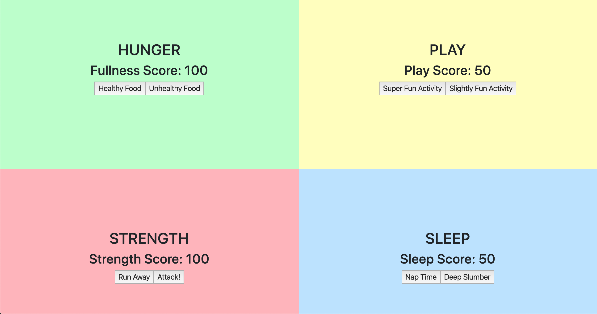

# Tamagotchi

## Description
Class assignment to learn skills in SASS and making modules that are laced together using webpack. Styling was done exclusively in SASS.

The Tamagotchi website acts like a personal pet Tamagotchi. It is divided into 4 quadrants. The Hunger quadrant that has two buttons to increase fullness. Play quadrant that has two activity buttons to increase play score. Strength quadrant that has two buttons that affect the Strength score. And Sleep quandrant that has two buttons that can increase the sleep score. 

## Screenshots

How to Run:

1. Clone the project through github clone feature
1. Install and run npm using node.js: 
https://nodejs.org/en/download/
1. Using VS Code open a terminal window and run 
npm install and npm start.

